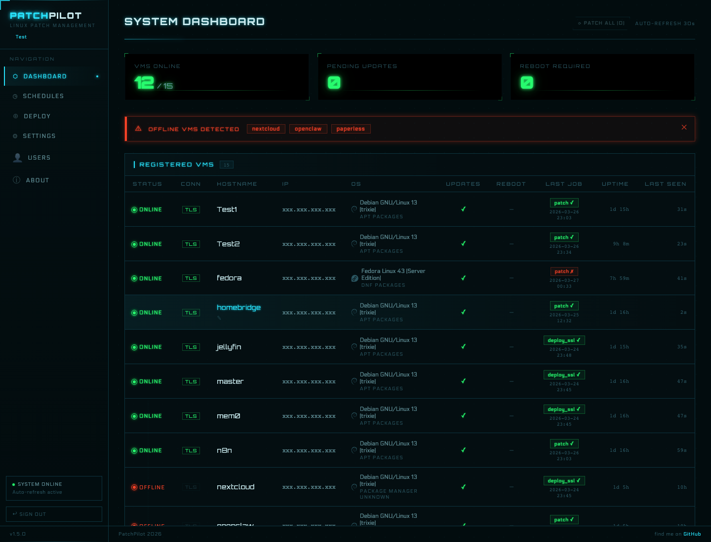
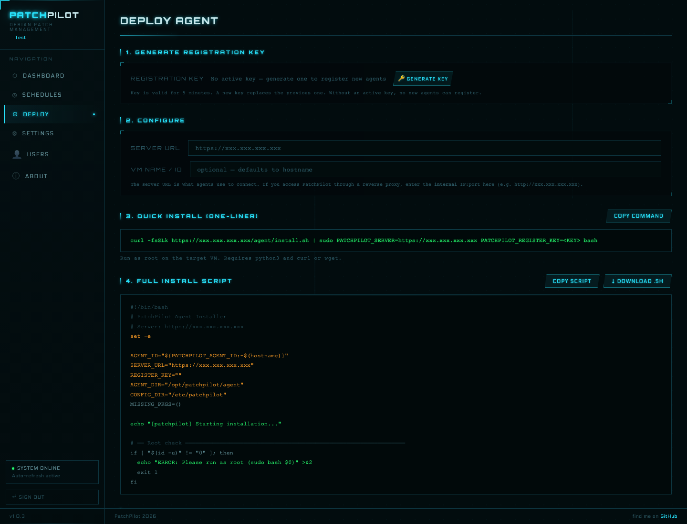
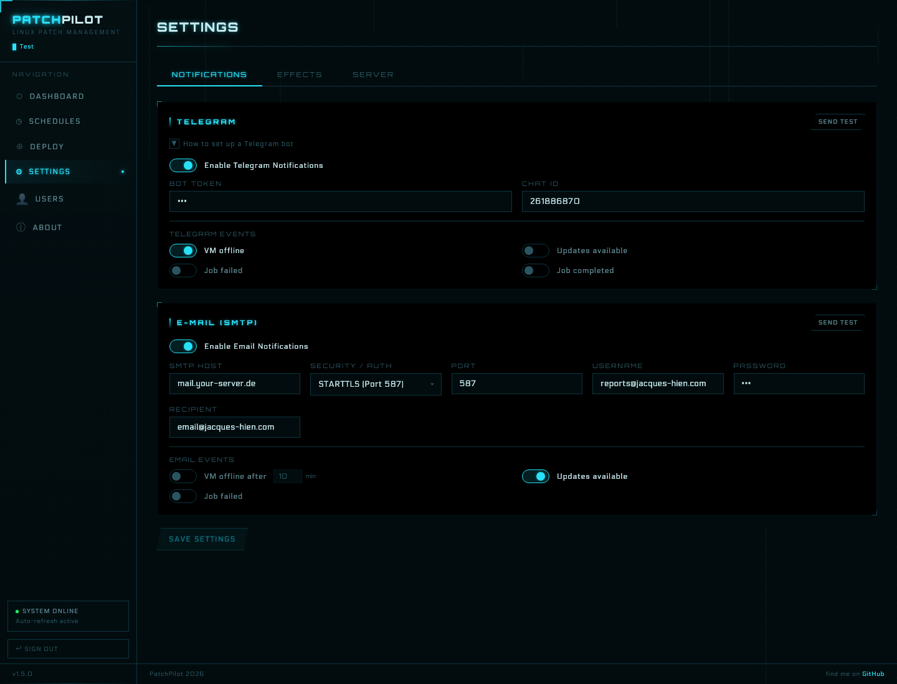

# PatchPilot

Self-hosted patch management for Linux VMs, built for homelabs and small Linux fleets.


PatchPilot uses a pull-based agent model: every VM polls the server for work, so you do not need SSH fan-out, inbound access to guests, or extra Python dependencies on the agent side.

Today, PatchPilot is strongest on Debian/Ubuntu server hosts and Linux clients. RPM support currently applies to managed client systems and agents such as Fedora, while broader server-side RPM installation support is planned for a later release.

## Why PatchPilot

- **No SSH orchestration required**: agents initiate every connection
- **Fast to self-host**: one-liner installer for the server, one-liner installer for agents
- **Best on apt, now expanding to RPM**: Debian and Ubuntu are the mature path for the PatchPilot server, while Fedora/RPM support is already available for managed clients, patching, reboot tracking, and agent self-update
- **Small operational footprint**: SQLite backend, stdlib-only Python agent, systemd deployment
- **Actually pleasant to use**: responsive Arwes sci-fi UI for desktop and mobile

## Who It Is For

PatchPilot is aimed at:

- homelab operators managing a handful of Linux VMs
- small internal environments that want patch visibility without a full enterprise suite
- self-hosters who prefer pull agents over SSH-driven automation

It is not trying to replace enterprise endpoint management platforms. It is intentionally lightweight and optimized for small-to-medium Linux estates you control yourself.

If you want a lightweight, self-hosted alternative to doing everything manually or reaching for a much larger management stack, this is the niche PatchPilot is built for.

## Quick Start

Choose one installation path:

- **Docker / GHCR**
  Best if you want the fastest self-hosted server setup with a visible host data path under `/opt/patchpilot`.
- **Bare Metal / systemd**
  Best if you want a native Debian/Ubuntu service install without Docker.

### Docker Server

1. Download the ready-to-use Compose file:

```bash
curl -fsSL https://raw.githubusercontent.com/DazClimax/patchpilot/v1.6.3/docker-compose.yml -o docker-compose.yml
```

2. Review or adjust the defaults:

```yaml
services:
  patchpilot:
    image: ghcr.io/dazclimax/patchpilot:v1.6.3
    container_name: patchpilot
    restart: unless-stopped
    security_opt:
      - no-new-privileges:true
    ports:
      - "8443:8443"
      - "8050:8050"
    environment:
      PORT: "8443"
      AGENT_PORT: "8050"
      AGENT_SSL: "1"
      # Optional:
      # PATCHPILOT_ADMIN_PASSWORD: "change-me"
      # PATCHPILOT_ADMIN_KEY: "set-a-long-random-hex-key"
      # PATCHPILOT_ALLOWED_ORIGINS: "http://localhost:5173,http://localhost:8000"
    volumes:
      - /opt/patchpilot:/data
```

3. Start the stack:

```bash
docker compose up -d
```

4. Read the generated bootstrap password if you did not predefine `PATCHPILOT_ADMIN_PASSWORD`:

```bash
sudo cat /opt/patchpilot/bootstrap-admin.txt
```

Docker notes:

- Host data is persisted under `/opt/patchpilot`
- Docker creates `/opt/patchpilot` automatically on first start if it does not exist yet
- Runtime log file is persisted under `/opt/patchpilot/logs/server.log`
- The bootstrap file is removed automatically after the first successful login

Optional Docker settings:

```yaml
environment:
  PATCHPILOT_ADMIN_PASSWORD: "change-me"
  PATCHPILOT_ADMIN_KEY: "set-a-long-random-hex-key"
```

If you want to build locally from the cloned repository instead of using GHCR, replace the service definition with:

```yaml
services:
  patchpilot:
    build:
      context: .
      dockerfile: Dockerfile
    image: patchpilot:1.6.3
```

Then run:

```bash
docker compose up -d --build
```

### Bare Metal Server

1. Install the server:

```bash
curl -fsSL https://raw.githubusercontent.com/DazClimax/patchpilot/v1.6.3/setup.sh | sudo bash
```

With custom ports:

```bash
curl -fsSL https://raw.githubusercontent.com/DazClimax/patchpilot/v1.6.3/setup.sh | sudo PORT=443 AGENT_PORT=8050 bash
```

Inspect before running:

```bash
curl -fsSL https://raw.githubusercontent.com/DazClimax/patchpilot/v1.6.3/setup.sh -o setup.sh
less setup.sh
sudo bash setup.sh
```

The bare metal installer currently targets Debian/Ubuntu hosts. It will:

- install system dependencies with `apt`
- install Node.js 20 when needed for the frontend build
- build the frontend locally
- install PatchPilot under `/opt/patchpilot`
- create a Python venv under `/opt/patchpilot-venv`
- generate a 3-year self-signed certificate
- start PatchPilot with separate UI and agent ports by default

2. Retrieve the generated bootstrap password if you did not predefine `PATCHPILOT_ADMIN_PASSWORD`:

```bash
sudo cat /opt/patchpilot/bootstrap-admin.txt
```

### Common Next Steps

#### Open The Web UI

Open:

```text
https://<server-ip>:8443
```

Your browser will warn about the self-signed certificate on first access. That is expected until you replace the certificate or trust your internal CA.

#### Add Your First Agent

Generate a registration key in the **Deploy** page, then copy the generated secure installer from the UI and run it on the target VM.

```bash
printf '%s' '<DEPLOY_PAGE_BASE64_INSTALLER>' | base64 -d | sudo bash
```

The Deploy page installer embeds the current registration key and, for HTTPS deployments, the CA certificate needed to verify subsequent downloads. That avoids the insecure `curl -k | bash` bootstrap pattern.

## What You Get

- **Dashboard**: online state, pending updates, reboot indicators, last jobs, and HTTP/TLS visibility
- **Patch jobs**: trigger package upgrades per VM or across the fleet (`apt` and current RPM client support via `dnf`)
- **Schedules**: cron-based automation for patching and reboots
- **Agent self-update**: distribute new agent code with SHA-256 verification
- **Notifications**: Telegram and SMTP with per-event controls
- **Role-based access**: `admin`, `user`, and `readonly`
- **SSL workflows**: generate certs, deploy CA to agents, and migrate protocols cleanly
- **Prometheus metrics**: monitoring endpoint for server-side visibility

## Why Pull Model Instead Of SSH

- VMs do not need inbound access
- agents behind NAT still work
- the server does not store SSH credentials for every machine
- firewalling is simpler because only outbound agent traffic is required
- agent upgrades and protocol migrations can be coordinated through the same job system

## Architecture

```text
Server (any Linux host)               Agents (Linux VMs)
├── FastAPI (dual-port)                agent.py (stdlib Python)
│   ├── UI port (HTTPS)                ├── polls for jobs every 10s
│   └── Agent port (HTTPS)             ├── heartbeat every 60s
├── SQLite (WAL mode)                  └── self-update capable
├── APScheduler (cron jobs)
├── React + Arwes (frontend)
├── Telegram / SMTP notifications
└── Prometheus metrics (/metrics)
```

By default, the UI and agent API run on separate ports. If both are configured to the same port, PatchPilot falls back to single-port mode.

## Tech Stack

| Layer | Technology |
|-------|-----------|
| Server | Python 3.10+, FastAPI, SQLite (WAL), APScheduler, uvicorn |
| Frontend | React 18, TypeScript, Vite, Arwes, font-logos |
| Agent | Python 3 stdlib only |
| Notifications | Telegram Bot API, SMTP |
| Deployment | systemd, rsync, shell scripts |

PatchPilot's sci-fi interface is built with [Arwes](https://arwes.dev).
Home Assistant OS is supported through a dedicated add-on, including backup, Core, Supervisor, OS, and add-on update workflows. Optional PatchPilot-triggered HA agent updates are available through a simple Home Assistant webhook automation: [HAOS Add-on Notes](docs/HAOS_ADDON.md).

## Security At A Glance

- session-based auth with PBKDF2-SHA256 password hashing
- legacy `x-admin-key` support for compatibility
- per-agent tokens stored hashed with SHA-256
- rotating registration keys with 5-minute TTL
- encrypted secrets at rest using Fernet-derived keys
- self-signed HTTPS enabled by default
- TLS 1.2 minimum on agent HTTPS connections
- SSRF checks for SMTP destinations
- dedicated service user with systemd hardening

## Configuration

Main server configuration lives in `/opt/patchpilot/.env`.

| Variable | Default | Description |
|----------|---------|-------------|
| `PORT` | `8443` | UI port |
| `AGENT_PORT` | `8050` | Agent API port |
| `AGENT_SSL` | `1` | Enable SSL on the agent port |
| `SSL_CERTFILE` | auto | Server certificate path |
| `SSL_KEYFILE` | auto | Server private key path |
| `PATCHPILOT_ADMIN_KEY` | auto | Legacy admin key and secret-encryption root |
| `PATCHPILOT_ADMIN_PASSWORD` | auto | Initial password for the default `admin` user |
| `PATCHPILOT_ALLOWED_ORIGINS` | localhost defaults | CORS origin allowlist |
| `PATCHPILOT_TRUSTED_PROXY` | empty | Trusted reverse-proxy IP |

## Development And Verification

### Local development

```bash
# Backend
cd server && uvicorn app:app --reload --port 8000

# Frontend
cd frontend && npm run dev
```

### Frontend smoke check

```bash
cd frontend && npm run build
```

This build succeeds in the current workspace. Vite surfaces one warning from an Arwes dependency about `eval`, but the build completes successfully.

### Backend tests

PatchPilot includes backend tests under `server/tests/`.

```bash
cd server
python3 -m pytest -q
```

In the current local environment, `pytest` is not installed, so the suite could not be executed here without installing dev dependencies first.

## Documentation

- [Installation Guide](docs/INSTALL.md)
- [Docker Notes](docs/INSTALL.md#docker)
- [Agent Documentation](docs/AGENT.md)
- [API Reference](docs/API.md)
- [Security Notes](SECURITY.md)
- [Changelog](CHANGELOG.md)
- [Contributing](CONTRIBUTING.md)

## Screenshots

### Dashboard



### Deploy Flow



### Settings



## Project Status

PatchPilot is published and usable today, with the current sweet spot being homelabs and small self-hosted Linux environments.

### Priorities

- **Now**: README clarity, install consistency, screenshots, contribution flow
- **Soon**: release hygiene on GitHub, broader testing visibility, more demo material
- **Later**: deeper automation, more distro coverage, optional enterprise-grade workflows

## Contributing

Issues and pull requests are welcome. If you want to report a bug or propose a feature, use the GitHub templates to keep reports actionable.

For security-sensitive findings, read [SECURITY.md](SECURITY.md) before opening a public issue.

## License

This project is licensed under the [GNU General Public License v3.0](https://www.gnu.org/licenses/gpl-3.0.html).

## Author

**DazClimax**
